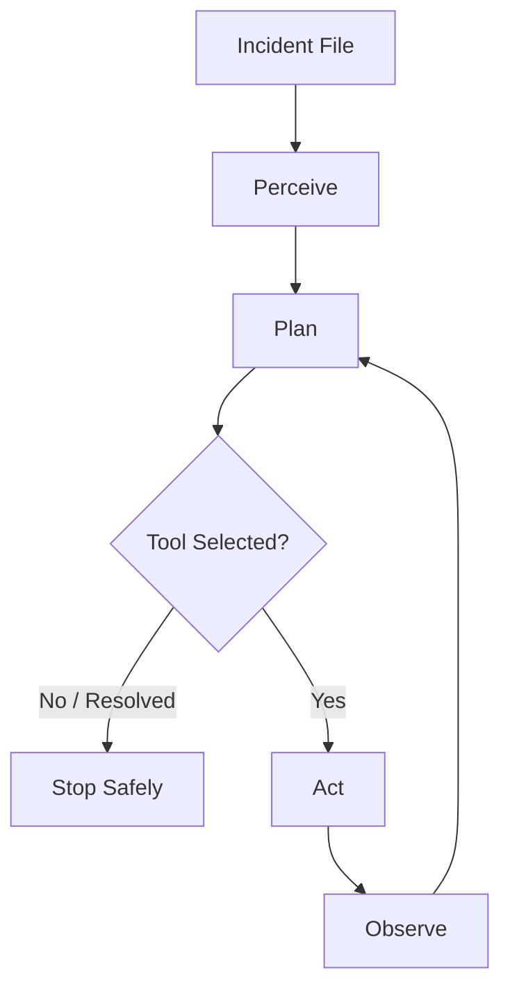

# SentinelOps — SRE/DevOps Incident Copilot

## Assignment Context

This repository is part of:

**Agentic AI Skill-Building Assignment — Cyclic Submission Track**

Current cycle:

**Cycle 1 — Single-agent incident triage loop**

---

## Problem Statement

SRE/DevOps incidents often begin with repetitive triage:

- read incident report
- identify affected service
- infer symptoms
- choose a diagnostic or remediation action
- execute it
- observe result
- decide next step

**SentinelOps** automates this initial triage loop using a local LLM and mock SRE tools.

---

## Cycle 1 Scope

The project currently implements a working single-agent loop:

```text
Perceive -> Plan -> Act -> Observe
```

Features implemented:

- incident file parsing
- rule-based perception
- LLM planning using Ollama + `gemma3:4b`
- Pydantic schema validation
- mock SRE tools
- bounded retry/recovery for tool failure
- hard stop using `max_iterations`
- explicit success-condition check
- JSONL stage logs
- final JSON run report
- CLI runner

---

## Frameworks / SDK / Versions

Cycle 1 uses:

| Component | Used For |
|---|---|
| Python 3.10+ | Core runtime |
| Ollama | Local LLM runtime |
| `gemma3:4b` | Primary local model |
| `requests` | Ollama HTTP API calls |
| `pydantic` | Structured output validation |
| `python-dotenv` | Environment variable loading |

Exact Python dependency versions are pinned in:

```text
requirements.txt
```

Cycle 1 uses a custom Python agent loop. LangGraph is planned for Cycle 3.

---

## Architecture



---

## Project Structure

```text
sre-copilot/
├── main.py
├── test_restart_recovery.py
├── requirements.txt
├── README.md
├── PROJECT_STATE.md
├── logs/
├── data/
│   └── incidents/
└── sre_copilot/
    ├── interfaces.py
    ├── llm_client.py
    ├── perceive.py
    ├── plan.py
    ├── tools.py
    ├── loop_logger.py
    └── agent.py
```

---

## Setup Instructions

Create and activate a virtual environment:

```powershell
python -m venv .venv
.venv\Scripts\Activate.ps1
```

Install dependencies:

```powershell
pip install -r requirements.txt
```

Create `.env` from `.env.example`. Do not commit secrets.

Required Cycle 1 variables:

```text
LLM_PROVIDER=ollama
OLLAMA_BASE_URL=http://127.0.0.1:11434
OLLAMA_MODEL=gemma3:4b
OLLAMA_NUM_PARALLEL=1
OLLAMA_MAX_LOADED_MODELS=1
```

Pull the model:

```powershell
ollama pull gemma3:4b
```

Verify Ollama:

```powershell
ollama list
```

---

## Run Instructions

Run one incident:

```powershell
python main.py data/incidents/incident_01_db_timeout.txt --max-iterations 3
```

Run all incidents sequentially:

```powershell
Get-ChildItem data\incidents\*.txt | ForEach-Object {
    python main.py $_.FullName --max-iterations 3
}
```

Run the deliberate restart-failure recovery test:

```powershell
python test_restart_recovery.py
```

---

## Sample Output

### Restart failure recovery test

Command:

```powershell
python test_restart_recovery.py
```

Abbreviated output:

```json
{
  "status": "resolved_success_condition",
  "resolved": true,
  "success_reason": "Tool failed initially but recovered: Recovered after 1 failed attempt(s). payments-api restarted successfully on attempt 2.",
  "last_plan": {
    "tool_name": "restart_service",
    "tool_args": {
      "service": "payments-api"
    }
  }
}
```

Final console output:

```text
SUCCESS: deliberate restart_service failure recovered without crashing.
```

This proves graceful retry/recovery without crashing.

---

### Incident triage run

Command:

```powershell
python main.py data/incidents/incident_04_crash_loop.txt --max-iterations 3
```

Abbreviated output:

```json
{
  "status": "resolved_success_condition",
  "resolved": true,
  "success_reason": "check_service_health executed successfully; treating as explicit success condition.",
  "last_plan": {
    "tool_name": "check_service_health",
    "tool_args": {
      "service": "notify-worker"
    }
  }
}
```

This also confirms that `svc=notify-worker` extraction works.

---

## Logging

Each run writes two files to `logs/`:

```text
logs/<run_id>.jsonl
logs/<run_id>.json
```

The `.jsonl` file contains stage events:

```text
perceive
plan
act
observe
```

The `.json` file contains the final consolidated run report.

Check logs:

```powershell
Get-ChildItem logs
```

---

## Design Notes

This project is optimized for a 16GB RAM laptop with 4GB VRAM.

Therefore:

- all Python packages run inside `.venv`
- Docker is not used in Cycle 1
- only one Ollama model is loaded at a time
- LLM calls are sequential
- no concurrent agent execution is used

The model strategy uses local `gemma3:4b` with a provider abstraction layer. This allows future switching to Gemini or GLM without rewriting agent code.

LLM JSON failures are handled using:

- schema validation
- JSON substring extraction
- retry with correction prompt
- safe fallback

This is a deliberate robustness decision.

---

## Current Limitations

- Tools are mock tools, not connected to real infrastructure.
- Cycle 1 success condition treats successful tool execution as success.
- Supabase persistence is not implemented yet.
- Multi-agent orchestration is planned for later cycles.

---

## Session Status

As of **Cycle 1, Session 3**, the following are working:

- Perceive
- Plan
- Act
- Observe
- full agent loop
- max iteration termination
- explicit success-condition check
- tool retry/recovery
- JSONL + JSON logging
- CLI execution
- all 4 synthetic incidents tested successfully